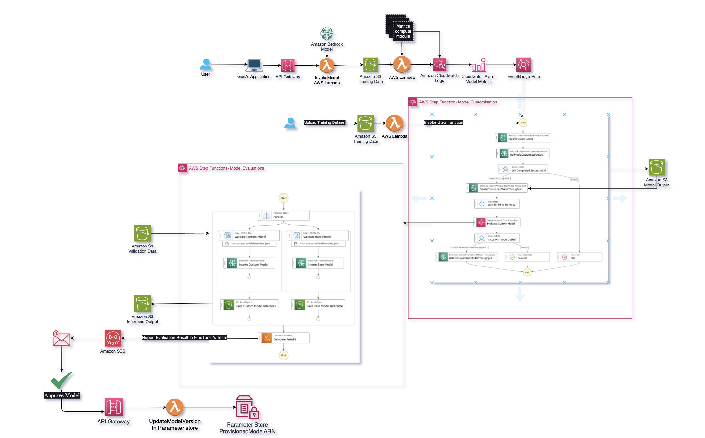

# Bedrock LLMOps Pipeline



## Deployment Instructions

1. Create a new directory, navigate to that directory in a terminal and clone the GitHub repository.

2. Change directory to the pattern directory:

   ```
   cd Amazon_Bedrock_LLMOps
   ```

3. Run the `build.sh` and `build2.sh to create the container images.

   ```
   bash build.sh
   ```

4. When asked enter the parameter values. Here are the sample values for `build.sh`:

   ```
   image_name=model-evaluation
   repo_name=bedrock-model-customization
   aws_account={your-AWS-account-id}
   aws_region={your-region e.g. us-east-1}
   ```

5. From the command line, use AWS SAM to deploy the AWS resources for the pattern as specified in the `template.yml` file:

   ```
   sam deploy --guided --profile <PROFILE_NAME>
   ```

6. Provide the below inputs when prompted::

   - Enter a stack name
   - Enter `ap-southeast-2` AWS Region or any other region where Amazon Bedrock and the required foundation model is available.
   - Enter `SenderEmailId` - Once the model customization is complete email will come from this email id. You need to have access to this mail id to verify the ownership.
   - Enter `RecipientEmailId` - User will be notified to this email id.
   - Enter `ContainerImageURI` - ContainerImageURI is available from the output of the `bash buildscript.sh` step.
   - Keep default values for the remaining fields.

7. Trigger the LLMOps pipeline by uploading the training data to the `TrainingDataBucket` S3 bucket.

8. While the model is being finetuned, make sure to upload the `reference-inference.json` and `validation-data.json` files to the `ValidationDataBucket` S3 bucket. These two files are required for the evaluation phase of the LLMOps pipeline.

## Cleanup

1. Delete the Amazon Bedrock provisioned throughput of the custom mode. _Ensure_ that the correct `ProvisionedModelArn` is provided to avoid accidental unwanted delete. Also update `your-region`:

   ```bash
   aws bedrock delete-provisioned-model-throughput --provisioned-model-id {ProvisionedModelArn} --region {your-region}
   ```

2. Delete the Amazon Bedrock custom model. _Ensure_ that the correct `CustomModelName` is provided to avoid accidental unwanted delete. Also update `your-region`:

   ```bash
   aws bedrock delete-custom-model --model-identifier {CustomModelName} --region {your-region}
   ```

3. Delete the content in the Amazon S3 bucket using the following command. _Ensure_ that the correct bucket name is provided to avoid accidental data loss. Also update `your-region`:

   ```bash
   aws s3 rm s3://{TrainingDataBucket} --recursive --region {your-region}
   aws s3 rm s3://{CustomizationOutputBucket} --recursive --region {your-region}
   aws s3 rm s3://{ValidationDataBucket} --recursive --region {your-region}
   aws s3 rm s3://{ModelInferenceBucket} --recursive --region {your-region}
   ```

4. To delete the resources deployed to your AWS account via AWS SAM, run the following command:
   ```bash
   sam delete
   ```
