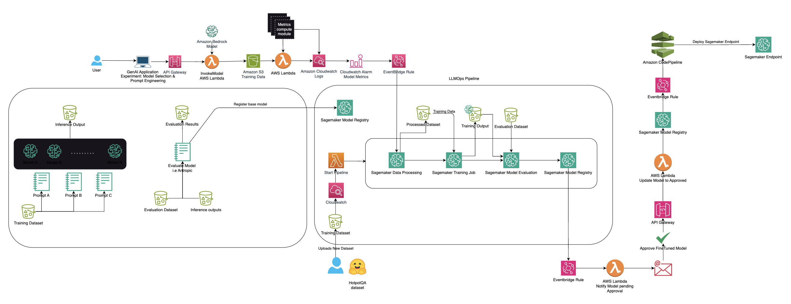
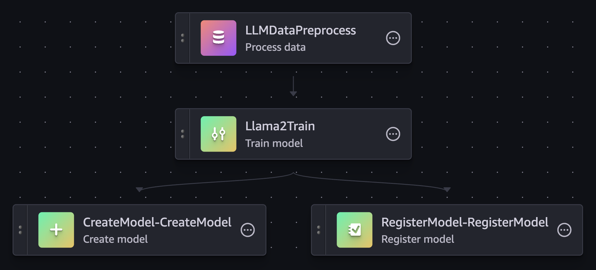

# SageMaker LLMOps Pipeline



## Deployment Instructions

1. Create a new directory, navigate to that directory in a terminal and clone the GitHub repository.

2. Change directory to the pattern directory:
   ```
   cd SageMaker_LLMOps/Pipeline
   ```

3.Follow Steps in `experiment-base-model.ipynb` to download the Model and store it in S3 bucket model artifacts. This notebook will also register the model in Sagemaker Model Registry.

4.Follow Steps in `sagemaker-pipeline-llm.ipynb` deploy the Sagemaker pipeline with three steps:

- Preprocessing
- Training & Evaluation
- Model Registry

5. At this point, you have deployed the SageMaker Pipeline. Now it's time to deploy the rest of the resources that are required for this solution to work end to end. For that:

6. Run the `build.sh` to create the container images for SendApprovalEmailFunction

   ```
   bash build.sh
   ```

7. When asked enter the parameter values. Here are the sample values for `build.sh`:

   ```
   image_name=notify-model-approval
   repo_name=sagemaker-llmops
   aws_account={your-AWS-account-id}
   aws_region={your-region e.g. us-east-1}
   ```

8. From the command line, use AWS SAM to deploy the AWS resources for the pattern as specified in the `template.yml` file:

   ```
   sam deploy --guided --profile <PROFILE_NAME>
   ```

9. Provide the below inputs when prompted:

   - Enter a stack name
   - Enter `ap-southeast-2` AWS Region or any other region where Amazon Bedrock and the required foundation model is available.
   - Enter `SenderEmailId` - Once the model customization is complete email will come from this email id. You need to have access to this mail id to verify the ownership.
   - Enter `RecipientEmailId` - User will be notified to this email id.
   - Enter `SendApprovalEmailImageUri` - SendApprovalEmailImageUri is available from the output of the `bash build.sh` step.
   - Enter `PipelineName` - Name of the SageMaker Pipeline to trigger ( can be found in the output of the `sagemaker-pipeline-llm.ipynb` notebook)
   - Enter `ModelPackageGroupName` - Name of the SageMaker Model Package Group ( can be found in the output of the `sagemaker-pipeline-llm.ipynb` notebook)
   - Enter `ModelPackageArn` - SageMaker Model Package ARN ( can be found in the output of the `sagemaker-pipeline-llm.ipynb` notebook)
   - Keep default values for the remaining fields.



10.Upload the Training dataset to Sagemaker s3 bucket that will initiate the pipeline run to process, train and evaluate the model.

11. After the pipeline run is completed, On uploading the dataset, the Sagemaker Pipeline will be invoked and the model will be registered in Sagemaker Model Registry.

12. Once the model is registered in Sagemaker Model Registry, an email will be sent to the user with the model details. On Approval, the model will be updated to Approved in model registry and will be ready for production deployment.

Enhancements:

- Automate Container Image Build and Deployment
- Use CDK or CloudFormation to create the SageMaker Pipeline.TBC
- At this point, we could also automate model deployment to SageMaker Endpoint. but that is out of scope for this notebooks.TBC

Full version of the notebooks can be found in [SageMaker_LLMOps](https://github.com/aws-samples/llmops-workshop).
Data source samples have been used from [HotPotQA](https://huggingface.co/datasets/hotpotqa/hotpot_qa)
